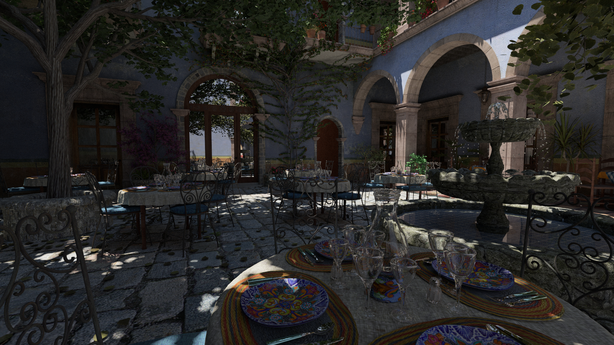

A physically based offline CPU pathtracer written in C++20

**REQUIREMENTS**:

- **C++20** compiler
- **Cmake 3.22+** for building

## Screenshots



Cloning the project:
```bash
git clone --recurse-submodules https://github.com/marko176/PathTracing.git
```
Building the project:
```bash
cd PathTracing
mkdir build
cmake -S . -B build -DCMAKE_BUILD_TYPE=Release
cmake --build ./build --config Release -j N   (set N to thread count)
```
To run the pathtracer do: `./Release/PathTracer`

Output images will be stored in: `Output/`

## Features:

- **Camera** with field of view and thin-lens approximation

- **BVH2** using SAH-based binned building, split into:
  - TLAS (Top-Level Acceleration Structure)
  - BLAS (Bottom-Level Acceleration Structure)

- **Model Loading** with [Assimp](https://github.com/assimp/assimp)

- **Physically Based Materials**
  - Microfacet Dielectric
  - Microfacet Diffuse
  - Specular Dielectric
  - Specular Conductor

- **Sampling**
  - Cosine-weighted importance sampling for Lambertian BRDF
  - [VNDF](https://jcgt.org/published/0007/04/01/) (visible normal distribution function) importance sampling for GGX specular BRDF 

- **Multiple Importance Sampling (MIS)**
  - based on [Veach (1997)](https://graphics.stanford.edu/papers/veach_thesis/), combined with Next Event Estimation (NEE) using the power heuristic

- **Texture Mapping**
  - Albedo, Normal, Roughness, Metallic, Emissive
  - support for HDR textures

- **Dependencies**
  - [Assimp](https://github.com/assimp/assimp)
  - [stb_image](https://github.com/nothings/stb)


